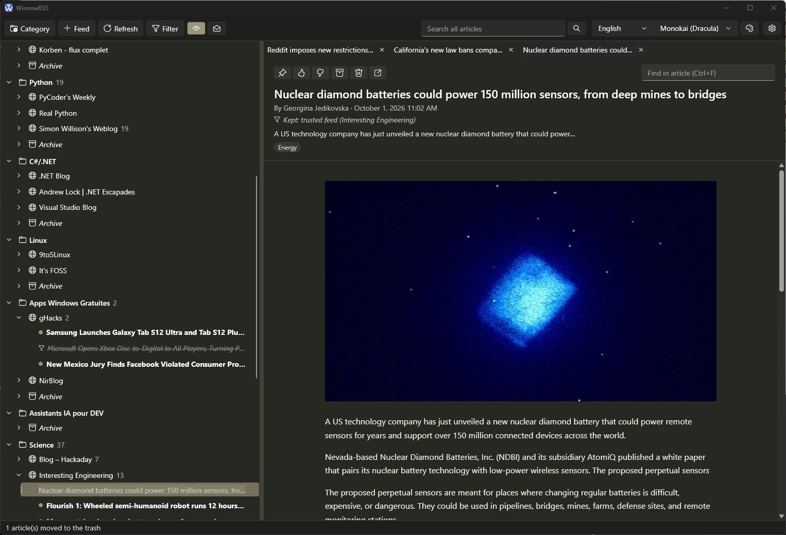

<p align="center"></p>

# WinnowRSS

**English** · [Français](README.fr.md)

A simple RSS reader for Windows that **filters articles by interest with a language model running on your own PC**. You describe what you care about and what you don't, in plain words; articles that don't match are set aside with the reason, never deleted. The same model can also summarize an article for you, in the language of your choice.

> Built with [Claude Code](https://claude.com/claude-code): the author's challenge was to write **no line of code by hand**. Design, code, tests, icon and documentation were all produced by the AI agent, with the author deciding and testing. See [docs/DESIGN.md](docs/DESIGN.md).



## Features

- **Feeds in categories**, shown as a tree with the articles under each feed; drag and drop a feed to another category.
- **Reading in tabs**: the article's header (title, author, date, description, tags), then the full content. Links open in your browser; feed scripts never run.
- **Interest filter** with a local model (Ollama): interests and exclusions in plain words, keywords and trusted feeds as rules, and a verdict with its reason on every article. Filtered-out articles stay in the tree, grayed out, or hidden.
- **Summaries** on request, by the same local model: a one-sentence gist and 3 to 5 key points, in English, French or Spanish whatever the article's language. They are saved with the article and shown again when you reopen it.
- **Archive** per category (the article and its images are kept), **trash** that can be restored, pins, 👍/👎 ratings.
- **Full-text search** across all articles, accent-insensitive.
- **Themes**: light, dark, follow Windows, or any **VS Code color theme** from Open VSX or a file.
- Interface in **English, French and Spanish**, switched live.
- **Settings**: open articles with a single or double click, how unread and filtered-out articles stand out, maximum number of open tabs, default zoom; the About box (version and credits) is at the bottom.
- Feeds refresh every 30 minutes. Read articles and the trash are purged after 30 days, except pinned, rated and archived ones.

## Requirements

- Windows 10 or 11, 64-bit.
- The **Microsoft Edge WebView2 Runtime**, already installed on Windows 11 and on most Windows 10 machines ([download](https://developer.microsoft.com/microsoft-edge/webview2/)).
- For the filter and the summaries (optional): [Ollama](https://ollama.com) and the `qwen3:8b` model, which needs about 7 GB of memory on the graphics card (it also runs on the processor, more slowly).

## Install

### From a release

1. Download `WinnowRSS-<version>-win-x64.zip` from the [Releases](../../releases) page.
2. Extract it anywhere, for example `%LOCALAPPDATA%\Programs\WinnowRSS`, and run `WinnowRSS.exe`. Nothing else to install: .NET is included.
3. The executable is not signed, so Windows SmartScreen may warn you the first time: choose **More info**, then **Run anyway**.

### From source

You need the [.NET 10 SDK](https://dotnet.microsoft.com/download).

```
git clone <this repository>
cd winnowrss
dotnet run --project src/Winnow.App
```

Tests: `dotnet test WinnowRSS.sln --filter "Category!=UI"` (the UI tests, without that filter, open windows on your desktop).

## First steps

1. **Category** in the toolbar creates a category; select it, then **Feed** adds a feed by its address (RSS or Atom).
2. Expand the feed and double-click an article to read it. Unread articles are in bold, with a colored dot.
3. Right-click a feed or an article for more: rename, refresh, open unread articles, archive, move to trash.

## The filter

1. Install Ollama, then in a terminal: `ollama pull qwen3:8b`.
2. In WinnowRSS, **Filter** in the toolbar: check **Filter new articles with a local model**, then **Test connection**.
3. Write your **interests** (topics to keep) and **exclusions** (topics to drop even if they match an interest), one short phrase each, in English or French. An article that matches no interest is filtered out too.
4. Two rules apply before the model and are instant:
   - **Keywords**: a title containing one of them (whole word, any case) is filtered out. Good for recurring topics the model hesitates on.
   - **Trusted feeds**: never filtered, all their articles are kept.
5. The eye button in the toolbar shows or hides filtered-out articles. Hover over an article to see why it was kept or filtered out.

**Summaries** use the same Ollama address and model, even when filtering is off. **Summarize** in an article's toolbar writes one in the language you used last (at first, the interface's); the arrow next to it lets you pick another language, with a check mark for those already written. A summary takes a few seconds once the model is loaded.

Tips: keep criteria short and concrete; check **Filter unread articles again after saving** after a change. Rate articles 👍/👎 as you read: the [filter bench](tools/Winnow.FilterBench) replays the filter over your ratings to compare models and prompts (`dotnet run --project tools/Winnow.FilterBench -- --help`).

## Themes

The theme list in the toolbar switches between light, dark and the Windows setting. The palette button opens **Themes**: search the VS Code color themes on [Open VSX](https://open-vsx.org) and install one, or import a `.json` or `.vsix` file. The theme recolors the whole window and the reading pane.

## Privacy

Everything stays on your PC. WinnowRSS connects only to the feeds you add and the images of their articles, to your local Ollama, and to Open VSX when you search for themes. No account, no telemetry.

## Data and uninstall

Your data lives in `%LOCALAPPDATA%\WinnowRSS`: `winnow.db` (feeds, articles, settings), `themes`, and `WebView2` (browser cache). To uninstall, delete the application folder and that folder.

## License

[MIT](LICENSE) © 2026 Gaétan Corneau. Third-party components: [THIRD-PARTY-NOTICES.md](THIRD-PARTY-NOTICES.md). Contributions: [CONTRIBUTING.md](CONTRIBUTING.md).
